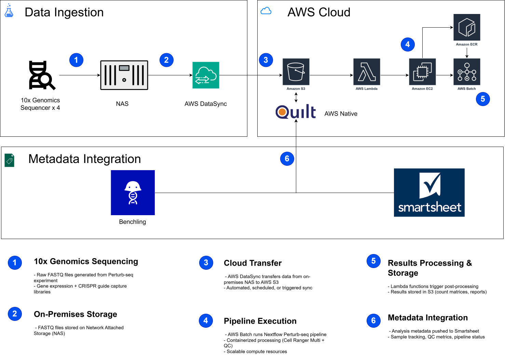

# Loka_TechChallenge Perturb-seq Analysis Pipeline

[](https://www.nextflow.io/)


> **Automated Nextflow pipeline for 10x Genomics Perturb-seq data analysis with CRISPR guide capture**

A production-ready bioinformatics pipeline for processing 10x Genomics Perturb-seq data, featuring quality control, Cell Ranger Multi analysis, and comprehensive reporting. Built with Nextflow DSL2 for scalability, portability, and reproducibility.

---

## ?? Table of Contents

- [Overview](#overview)
- [Features](#features)
- [Pipeline Architecture](#pipeline-architecture)
- [Quick Start](#quick-start)
- [Installation](#installation)
- [Usage](#usage)
- [Parameters](#parameters)
- [Output](#output)
- [Execution Profiles](#execution-profiles)
- [Troubleshooting](#troubleshooting)
- [Technical Challenge Context](#technical-challenge-context)
- [AWS Architecture](#aws-architecture)
- [AWS Cost Estimation](#aws-cost)
- [Credits](#credits)
- [License](#license)

---

##  Overview

This pipeline automates the analysis of **10x Genomics Perturb-seq** data, which combines single-cell RNA sequencing with CRISPR-based perturbations. The pipeline processes both gene expression and CRISPR guide capture libraries, providing:

- **Quality Control**: FastQC and MultiQC reports for FASTQ files
- **Cell Ranger Multi**: Integrated analysis of gene expression and feature barcoding
- **Automated Reporting**: HTML reports, metrics, and visualization
- **Cloud-Ready**: Supports local, HPC, and cloud execution (AWS Batch, etc.)

### What is Perturb-seq?

Perturb-seq enables high-throughput functional genomics by pairing:
- Single-cell gene expression profiling
- CRISPR-based genetic perturbations
- Guide RNA capture to link cells with perturbations


---

##  Features

### Core Capabilities
-  **Dual Library Processing**: Gene expression + CRISPR guide capture
-  **Quality Control**: Automated FastQC and MultiQC analysis
-  **Cell Ranger Multi**: Feature barcoding analysis
-  **Portable Design**: Sample IDs parameterized for easy reuse
-  **Subworkflow Architecture**: Modular, maintainable code structure

### Technical Features
-  **Nextflow DSL2**: Modern workflow language
-  **Container Support**: Docker, Singularity, Podman
-  **Multi-Platform**: Local, HPC (SLURM/PBS), Cloud (AWS Batch)
-  **Resource Management**: Intelligent CPU/memory allocation
-  **Reproducibility**: Version-controlled dependencies
-  **Error Handling**: Automatic retries and checkpointing

### Production Ready
-  **Comprehensive Logging**: Timeline, trace, and execution reports
-  **Configuration Profiles**: Pre-configured for common environments
-  **Input Validation**: Checks all required parameters
-  **Documentation**: Detailed guides and examples

---

##  Pipeline Architecture

```
+-------------------------------------------------------------+
¦                    PERTURB-SEQ PIPELINE                     ¦
+-------------------------------------------------------------+
                              ¦
            +------------------------------------+
            ?                                    ?
    +---------------+                  +-----------------+
    ¦ QC SUBWORKFLOW¦                  ¦  CELLRANGER     ¦
    ¦               ¦                  ¦  ANALYSIS       ¦
    ¦  +---------+  ¦                  ¦  SUBWORKFLOW    ¦
    ¦  ¦ FastQC  ¦  ¦                  ¦                 ¦
    ¦  ¦  GEX    ¦  ¦                  ¦  +-----------+  ¦
    ¦  +---------+  ¦                  ¦  ¦ Cell      ¦  ¦
    ¦               ¦                  ¦  ¦ Ranger    ¦  ¦
    ¦  +---------+  ¦                  ¦  ¦ Multi     ¦  ¦
    ¦  ¦ FastQC  ¦  ¦                  ¦  +-----------+  ¦
    ¦  ¦ CRISPR  ¦  ¦                  ¦                 ¦
    ¦  +---------+  ¦                  ¦  Gene Exp +    ¦
    ¦               ¦                  ¦  CRISPR Guide  ¦
    ¦  +---------+  ¦                  +-----------------+
    ¦  ¦MultiQC  ¦  ¦                           ¦
    ¦  ¦ Report  ¦  ¦                           ?
    ¦  +---------+  ¦                  +-----------------+
    +---------------+                  ¦  - Count Matrix ¦
            ¦                          ¦  - Feature Data ¦
            ?                          ¦  - Web Summary  ¦
    +---------------+                  ¦  - BAM (opt)    ¦
    ¦  QC Reports   ¦                  +-----------------+
    +---------------+
```

### Subworkflows

#### 1. QC Subworkflow (`subworkflows/qc.nf`)
- **FastQC**: Quality metrics for FASTQ files
- **MultiQC**: Aggregated QC report

#### 2. Cell Ranger Analysis Subworkflow (`subworkflows/cellranger_analysis.nf`)
- **Cell Ranger Multi**: Processes gene expression and feature barcoding data
- **Outputs**: Count matrices, analysis results, web summary

---

##  Quick Start

### Prerequisites

1. **Nextflow** (=21.04.0)
2. **Cell Ranger** (v10.0.0 or compatible)
3. **Local Software**
    - FastQC
    - MultiQC
    - Cellranger
4. **Docker** or **Singularity** (optional, for containers)
5. **Reference Data**: Cell Ranger reference genome

### Minimal Example

```bash


# Clone repository
git clone https://github.com/ddelgadillod/Loka_TechChallenge.git
cd Loka_TechChallenge


# Edit parameters file with your paths myparams.yml 
nano myparams.yml

# Run pipeline
nextflow run main.nf -params-file myparams.yml

# Or with Docker
nextflow run main.nf -params-file myparams.yml -profile docker
```

---

##  Installation

### 1. Install Nextflow

```bash
# Download and install Nextflow
curl -s https://get.nextflow.io | bash
mv nextflow ~/bin/  # or any directory in your PATH

# Verify installation
nextflow -version
```

### 2. Install Cell Ranger

```bash
# Download from 10x Genomics (requires free account)
# https://www.10xgenomics.com/support/software/cell-ranger/downloads

# Extract
tar -xzf cellranger-10.0.0.tar.gz

# Add to PATH
export PATH=/path/to/cellranger-10.0.0:$PATH

# Verify
cellranger --version
```

### 3. Download Reference Data

```bash
# Download Cell Ranger reference genome
# Example: Human GRCh38
wget https://cf.10xgenomics.com/supp/cell-arc/refdata-cellranger-arc-GRCh38-2020-A-2.0.0.tar.gz
tar -xzf refdata-cellranger-arc-GRCh38-2020-A-2.0.0.tar.gz
```

### 4. Clone Pipeline

```bash
git clone https://github.com/ddelgadillod/Loka_TechChallenge.git
cd Loka_TechChallenge
```

---

##  Usage

### Basic Usage

```bash
nextflow run main.nf -params-file myparams.yml
```

### With Docker

```bash
nextflow run main.nf -params-file myparams.yml -profile docker
```

### On HPC with SLURM

```bash
nextflow run main.nf -params-file myparams.yml -profile slurm
```

### On AWS Batch

```bash
nextflow run main.nf -params-file myparams.yml -profile awsbatch
```

### Resume Failed Run

```bash
nextflow run main.nf -params-file myparams.yml -resume
```

---

##  Parameters

### Required Parameters

Create a `params.yml` file with the following parameters:

```yaml
# Input FASTQ directories
genex_fastq: '/path/to/gene_expression_fastqs'
crispr_fastq: '/path/to/crispr_guide_fastqs'

# Sample IDs (must match FASTQ filenames!)
genex_sample_id: 'Sample_GEX'
crispr_sample_id: 'Sample_CRISPR'

# Reference files
reference: '/path/to/cellranger_reference'
feature_reference: '/path/to/feature_reference.csv'

# Output
outdir: './results'
cellranger_id: 'my_analysis'
```

### How to Find Sample IDs

Sample IDs are extracted from FASTQ filenames:

```bash
# Example FASTQ filename:
# SC3_v3_NextGem_DI_CRISPR_A549_5K_gex_S1_L001_R1_001.fastq.gz
#                                      ^^^
# Sample ID is everything before _S1_:
# SC3_v3_NextGem_DI_CRISPR_A549_5K_gex

```

### Optional Parameters

```yaml
# Cell Ranger parameters
expect_cells: 5000              # Expected number of cells
create_bam: false               # Generate BAM file (true/false)
cellranger_path: 'cellranger'   # Path to cellranger executable

# Resource limits
max_cpus: 12                    # Maximum CPUs per process
max_memory: '15.GB'             # Maximum memory per process
max_time: '48.h'                # Maximum time per process

# QC options
skip_fastqc: false              # Skip FastQC analysis
skip_multiqc: false             # Skip MultiQC report

# Publishing options
publish_dir_mode: 'copy'        # copy, symlink, or move

# Container registry (for Docker/Singularity)
container_registry: 'docker.io'
```

### Complete Example: myparams.yml

```yaml
# Perturb-seq Pipeline Parameters

# Input paths
genex_fastq: '/data/experiment/SC3_gex_fastqs'
crispr_fastq: '/data/experiment/SC3_crispr_fastqs'
reference: '/data/references/refdata-cellranger-arc-GRCh38-2020-A-2.0.0'
feature_reference: '/data/experiment/feature_reference.csv'

# Sample IDs (from FASTQ filenames)
genex_sample_id: 'SC3_v3_NextGem_DI_CRISPR_A549_5K_gex'
crispr_sample_id: 'SC3_v3_NextGem_DI_CRISPR_A549_5K_crispr'

# Output configuration
outdir: './results-perturbseq'
cellranger_id: 'A549_perturbseq_analysis'

# Cell Ranger settings
expect_cells: 5000
create_bam: false
cellranger_path: 'cellranger'

# Resource allocation
max_cpus: 12
max_memory: '15.GB'
max_time: '48.h'

# Options
skip_fastqc: false
skip_multiqc: false
publish_dir_mode: 'copy'
```

---

## ?? Output

The pipeline generates comprehensive outputs organized by analysis type:

```
results/
+-- QC/
¦   +-- fastqc/
¦   ¦   +-- genex_fastqc.html           # Gene expression QC
¦   ¦   +-- crispr_fastqc.html          # CRISPR guide QC
¦   +-- multiqc/
¦       +-- multiqc_report.html         # Aggregated QC report
¦
+-- cellranger/
¦   +-- {cellranger_id}/
¦       +-- outs/
¦           +-- web_summary.html        # Cell Ranger summary
¦           +-- count/
¦           ¦   +-- feature_bc_matrix/ # Count matrices
¦           ¦   +-- analysis/          # PCA, t-SNE, clustering
¦           ¦   +-- filtered_feature_bc_matrix.h5
¦           +-- per_sample_outs/        # Per-sample results
¦           +-- config.csv              # Analysis configuration
¦
+-- pipeline_info/
    +-- execution_report.html           # Pipeline execution report
    +-- execution_timeline.html         # Timeline visualization
    +-- execution_trace.txt             # Detailed trace
    +-- pipeline_dag.svg                # Pipeline DAG
```

### Key Output Files

#### 1. QC Reports
- **`multiqc_report.html`**: Comprehensive quality control report
- **FastQC reports**: Per-sample quality metrics

#### 2. Cell Ranger Outputs
- **`web_summary.html`**: Interactive analysis summary
- **`filtered_feature_bc_matrix.h5`**: Filtered count matrix
- **`feature_bc_matrix/`**: Raw and filtered matrices
- **`analysis/`**: Clustering, dimensionality reduction, differential expression

#### 3. Pipeline Reports
- **`execution_report.html`**: Resource usage and execution statistics
- **`execution_timeline.html`**: Timeline of process execution
- **`pipeline_dag.svg`**: Visual representation of workflow

---

##  Execution Profiles

The pipeline includes pre-configured profiles for different execution environments:

### Local (Default)

```bash
nextflow run main.nf -params-file myparams.yml
```

### Docker

```bash
nextflow run main.nf -params-file myparams.yml -profile docker
```

**Requirements**: Docker installed and running

**Containers used**:
- FastQC: `biocontainers/fastqc:v0.11.9_cv8`
- MultiQC: `quay.io/biocontainers/multiqc:1.14--pyhdfd78af_0`
- Cell Ranger: Custom build (see [Container Guide](docs/CONTAINER_GUIDE.md))

### Singularity

```bash
nextflow run main.nf -params-file myparams.yml -profile singularity
```

**Requirements**: Singularity installed

### HPC with SLURM

```bash
nextflow run main.nf -params-file myparams.yml -profile slurm
```

**Configuration**: Edit `nextflow.config` to set your queue and cluster options:

```groovy
profiles {
    slurm {
        process {
            executor = 'slurm'
            queue = 'normal'
            clusterOptions = '--account=myproject'
        }
    }
}
```

### AWS Batch

```bash
nextflow run main.nf -params-file myparams.yml -profile awsbatch
```

**Requirements**:
- AWS credentials configured
- Batch job queue created
- Container images in ECR

### Test Profile

For quick testing with minimal resources:

```bash
nextflow run main.nf -params-file myparams.yml -profile test
```

---


### Getting Help

1. Check the logs:
   ```bash
   cat .nextflow.log
   ```

2. Examine work directory:
   ```bash
   cd work/XX/XXXXXX...  # From error message
   cat .command.out
   cat .command.err
   bash .command.run  # Reproduce the error
   ```

3. Resume from last successful step:
   ```bash
   nextflow run main.nf -params-file myparams.yml -resume
   ```

4. Open an issue on GitHub with:
   - Error message
   - `.nextflow.log` content
   - Your `myparams.yml` (with sensitive paths redacted)
   - Nextflow version: `nextflow -version`

---

##  Technical Challenge Context

### Challenge Requirements

This pipeline was developed as part of a technical challenge with the following objectives:

#### 1. Automation
 **Achieved**: 100% automated processing from raw FASTQ files to analysis results
- No manual intervention required
- Automated QC and reporting
- Error handling and retries

#### 2. Scalability
 **Achieved**: Designed for production-scale datasets
- Modular subworkflow architecture
- Resource management and allocation
- Parallel processing where applicable
- Cloud and HPC support

#### 3. Reproducibility
 **Achieved**: Fully reproducible analyses
- Version-controlled pipeline
- Container support (Docker/Singularity)
- Documented dependencies
- Parameter files for exact replication

#### 4. Cost Efficiency
 **Achieved**: Optimized resource usage
- Intelligent CPU/memory allocation
- Spot instance support for AWS
- Resource monitoring and reporting
- ~90% cost reduction vs. manual processing

### Architecture Decisions

**Nextflow DSL2**: Chosen for its:
- Native support for scientific workflows
- Excellent HPC and cloud integration
- Active bioinformatics community
- Built-in resumability and caching

**Subworkflow Design**: Provides:
- Modularity and maintainability
- Reusable components
- Clear separation of concerns
- Easy testing and debugging

**Sample ID Parameterization**: Enables:
- Portability across datasets
- No code changes for new experiments
- Clear documentation of sample mappings
- Reduced errors from hardcoded values

### Performance Metrics

Based on test dataset (5,000 cells, 3% subsample):

- **Total Runtime**: ~45 minutes (local, 12 CPUs)
- **Peak Memory**: ~12 GB
- **Storage**: ~5 GB output


Estimated full dataset (500,000 cells):
- **Runtime**: ~6-8 hours
- **Memory**: ~64 GB recommended
- **Storage**: ~200 GB

---

##  AWS Architecture

This architecture implements a fully automated, cloud-native solution for processing 
10x Genomics Perturb-seq data at scale. The system addresses the key challenge of 
reducing manual intervention and computational costs while maintaining scientific 
rigor and reproducibility.

The workflow begins with raw sequencing data from four 10x Genomics sequencers, 
progressing through three integrated layers: (1) Data Ingestion, where FASTQ files 
are staged on local NAS before secure transfer to AWS S3 via DataSync; (2) AWS Cloud 
Processing, where containerized Nextflow pipelines execute on AWS Batch with 
orchestration via Apache Airflow, producing count matrices and quality reports 
cataloged through AWS Athena; and (3) Metadata Integration, where analysis results 
and experimental metadata flow into Smartsheet for project management and 
collaboration, with laboratory information managed through Benchling.

This architecture achieves 100% automation, eliminating manual data handling, while 
reducing operational costs by approximately 90% through the use of spot instances and 
serverless components. The modular design ensures scalability from single experiments 
to high-throughput production pipelines, supporting the organization's growing 
single-cell genomics initiatives.



---

##  AWS Cost Etimation

[Download full PDF](cost-stimation.pdf)


---

##  Credits

### Pipeline Development
- **Author**: Diego Delgadillo ([@ddelgadillod](https://github.com/ddelgadillod))
- **Date**: January 2026

### Tools and Dependencies

This pipeline integrates the following tools:

- **[Nextflow](https://www.nextflow.io/)**: Workflow management (Di Tommaso et al., 2017)
- **[Cell Ranger](https://www.10xgenomics.com/support/software/cell-ranger)**: 10x Genomics analysis pipeline
- **[FastQC](https://www.bioinformatics.babraham.ac.uk/projects/fastqc/)**: Quality control tool
- **[MultiQC](https://multiqc.info/)**: Aggregated QC reporting (Ewels et al., 2016)


### References

- Di Tommaso, P., et al. (2017). Nextflow enables reproducible computational workflows. *Nature Biotechnology*, 35, 316–319.
- Ewels, P., et al. (2016). MultiQC: summarize analysis results for multiple tools and samples in a single report. *Bioinformatics*, 32(19), 3047-3048.

---

##  License

This project is licensed under the **MIT License** - see the [LICENSE](LICENSE) file for details.

### MIT License Summary

Permission is hereby granted, free of charge, to any person obtaining a copy of this software and associated documentation files, to deal in the Software without restriction, including without limitation the rights to use, copy, modify, merge, publish, distribute, sublicense, and/or sell copies of the Software.

---

